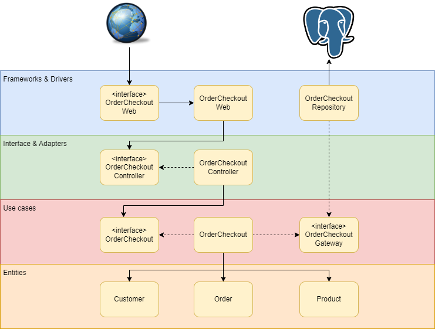
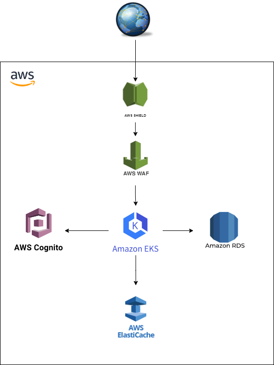

# Tech Challenge

Esse projeto foi desenvolvido para a pós graduação de arquitetura de software.


## Vídeo explicativo
https://youtu.be/cWMxH8cwsAs?si=0SGGOOIOajGgWauc


## O problema
A lanchonete de bairro, em expansão, enfrenta desafios sem um sistema de controle de pedidos. Com pedidos complexos e sem sistema, há risco de erros, atrasos e insatisfação dos clientes. A solução é um sistema de autoatendimento, que permite aos clientes fazer pedidos diretamente, reduzindo confusões e melhorando a eficiência.


## A solução
DDD: [miro](https://miro.com/welcomeonboard/Z2hwMTJic3V1akhyZmxTNGtTMWNTWXp4VnVPa09rd1FIYTNac3RMQzBxa21IVXVXRFJZMG5EanRoZ2ZjV2NTNnwzMDc0NDU3MzYwMjEzNjU2NjU1fDI=?share_link_id=653145671350)

### **Clean Architecture**



Para garantir a separação de responsabilidades e a independência das regras de negócios em relação a frameworks e interfaces de usuário, esse software foi desenvolvido baseado na Clean Architecture.

O diagrama acima ilustra a implementação do caso de uso de checkout de pedidos

**Camadas:**

* **Frameworks & Drivers:** Representa os mecanismos de entrada e saída do sistema, incluindo:
  - **OrderCheckout Web:** Interface que lida com as interações do usuário via web:
  - **OrderCheckout Repository:** Componente responsável pela persistência dos dados, sugerindo a utilização de um banco de dados (simbolizado pelo ícone de elefante, comumente associado ao PostgreSQL).
  
* **Interface & Adapters:** Contém adaptadores que convertem dados entre a camada de casos de uso e a camada de frameworks & drivers:
    - **OrderCheckout Controller:** Controlador que processa as solicitações da interface web e as transmite para os casos de uso apropriados.
    
* **Use Cases:** Esta camada central contém a lógica de aplicação do sistema:
  - **OrderCheckout:** O caso de uso principal que executa o processo de checkout de um pedido.
  - **OrderCheckout Gateway:** Interface que abstrai a comunicação com outros sistemas ou bancos de dados externos.
  
* **Entities:** Inclui os objetos de negócios fundamentais do sistema:
  - **Customer:** Define as propriedades e comportamentos de um cliente dentro do sistema.
  
  - **Order:** Encapsula os detalhes de um pedido, incluindo itens e quantidades.
  
  - **Product:** Representa os produtos disponíveis para compra.
  
    

### **Kubernets**
Para uma implementação robusta e escalável é utilizado o Kubernetes, fornecendo alta disponibilidade e eficiência no gerenciamento de recursos.
Sendo implementando os seguintes objetos do Kubernetes, contidos no diretório k8s.

* **Deployment:** Garante que duas réplicas do pod estejam rodando, com verificações de saúde definidas para garantir disponibilidade e confiabilidade.

* **HorizontalPodAutoscaler (HPA):** Para escalar horizontalmente os pods entre 2 a 5 réplicas, dependendo da utilização de cpu.

* **Service:** Expõe o deployment tech-challenge2 para a rede fora do cluster Kubernetes, utilizando um serviço do tipo NodePort, mapeando a porta 8080 do cluster para a porta 30009 do nó.

* **Pod (postgres):** Cria um pod independente para o PostgreSQL.

* **Service (postgres-service):** Cria um serviço para expor o banco de dados PostgreSQL dentro do cluster na porta 5432, permitindo a comunicação com outros serviços.

  

### **Pontos de evolução (AWS)**


Esta arquitetura representa uma evolução da aplicação na AWS, focando em reforçar a segurança e a performance, utilizando as seguintes soluções:
* **AWS Shield:** Serviço de proteção contra DDoS que salvaguarda aplicativos executados na AWS. Está posicionado na camada mais externa, logo após a entrada de tráfego da internet, protegendo toda a infraestrutura downstream.
* **AWS WAF:** Filtro de tráfego de aplicações web que permite controlar o tráfego que chega à aplicação, fornecendo proteção contra explorações web comuns.
* **Amazon EKS:** Serviço gerenciado que facilita a execução do Kubernetes na AWS sem necessidade de instalar e operar sua própria infraestrutura de gerenciamento do Kubernetes.
* **Amazon RDS:** Serviço de banco de dados relacional que facilita a configuração, operação e escalabilidade de bancos de dados em nuvem.
* **AWS Elasticache:** Serviço que melhora a velocidade de aplicações web ao permitir o armazenamento em cache de informações na memória, reduzindo a latência e o acesso a bancos de dados.
* **AWS Cognito:** Serviço que oferece controle de acesso e identidade para aplicações, permitindo autenticação, autorização e gerenciamento de usuários.


## Como executar localmente

Para simplificar a exeução as seguintes imagens estão publicdas no gitlab:
* **Aplicação:** registry.gitlab.com/ed-wantuil/tech-challenge-clean-architecture
* **Postgres:** registry.gitlab.com/ed-wantuil/tech-challenge-clean-architecture:postgres

Para executar o localmente é indicado a utilização do minikube.

Para utilizar basta executar o seguinte comando na raiz do projeto:

```
kubectl apply -f k8s/k8s.yml
```

E comando abaixo para disponbilizar a aplicação na porta local 8080:

```
kubectl port-forward service/tech-challenge2-service 8080:8080
```


## Contratos
postman: [TechChallenge.postman_collection.json](https://gitlab.com/ed-wantuil/tech-challenge-clean-architecture/-/blob/main/postman/TechChallenge.postman_collection.json?ref_type=heads)

swagger: http://localhost:8080/swagger-ui/index.html


## Como testar

**1.a.i -** Checkout Pedido que deverá receber os produtos solicitados e retornar a identificação do pedido.

```shell
curl --location 'http://localhost:8080/checkout' \
--header 'Content-Type: application/json' \
--data '{
    "customer": {
        "id": "4d1335a5-3627-42f3-8637-4e52b6e852bf"
    },
    "items": [
        {
            "product": "d3c97509-3d47-46f0-852a-d04d5a3b12f3",
            "quantity": 1,
            "price": 10.0
        },
        {
            "product": "3bfa8cc8-0a8d-43c1-9cda-94484c069cd9",
            "quantity": 1,
            "price": 10.0
        }
    ],
    "deliveryStatus": "PREPARING",
    "paymentStatus": "WAITING",
    "created": "2023-10-30",
    "amount": 20.0
}'
```


**1.a.ii -** Consultar status pagamento pedido, que informa se o pagamento foi aprovado ou não.

```shell
curl --location 'http://localhost:8080/order/find-by-id?id=db21f88b-bb46-456e-88e9-8bb365dd492a'
```


**1.a.iii -** Webhook para receber confirmação de pagamento aprovado ou recusado.

```shell
curl --location 'http://localhost:8080/order/update-payment-status-webhook' \
--header 'Content-Type: application/json' \
--data '{
    "id": "db21f88b-bb46-456e-88e9-8bb365dd492a",
    "paymentStatus": "PAID"
}'
```


**1.a.iv -** A lista de pedidos deverá retorná-los com suas descrições, ordenados com a seguinte regra.

* Pronto &gt; Em Preparação &gt; Recebido;

* Pedidos mais antigos primeiro e mais novos depois;

* Pedidos com status Finalizado não devem aparecer na lista.

```shell
curl --location 'http://localhost:8080/order/not-done'
```


**1.a.v -** Atualizar o status do pedido.

```shell
curl --location --request PATCH 'http://localhost:8080/order/update-delivery-status?id=715951ea-adc4-4d25-9c57-29d40959d06d&delivery-status=DONE'
```


**1.a.vi -** Mock de pagamento.

```
curl --location 'http://localhost:8080/order/update-payment-status-webhook' \
--header 'Content-Type: application/json' \
--data '{
    "id": "db21f88b-bb46-456e-88e9-8bb365dd492a",
    "paymentStatus": "PAID"
}'
```


**2.a -** Os requisitos funcionais descritos nos itens anteriores (item problema).

https://gitlab.com/ed-wantuil/tech-challenge-clean-architecture


**2.b -** Escalabilidade com aumento e diminuição de Pods conforme demanda.

Para o teste do hpa, podemos utilizar o teste de carga com o k6, com o seguinte comando:

```
k6 run loadTest/k6.js 
```


**2.c -** Os arquivos manifestos (yaml) precisam estar no Github junto com a nova versão do código.

https://gitlab.com/ed-wantuil/tech-challenge-clean-architecture/-/tree/main/k8s?ref_type=heads
